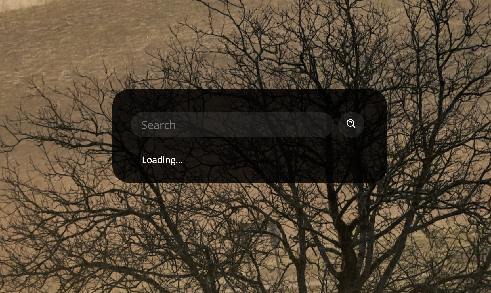

# Better Weather
## Description
Quick and easy way to find the current weather at your location.

## Table of Contents
- [Wireframe](#wireframe)
- [Instructions](#instructions)
- [Usage](#usage)
- [User Story](#user-story)
- [Future Directions](#future-directions)
- [Credits](#credits)
- [License](#license)

## Wireframe
Screenshots of working project.

Landing Page:<br>


Atlanta:<br>


Denver:<br>


Madrid:<br>


## Instructions
Type in the city of the place you want the current weather.


## Usage
## 👉 [This application is live!](https://bballplayer33.github.io/better-weather/)

## User Story

```
As a user I would like to lookup the current weather of where I am.
```
## Future Directions
Add 5 day future forcast

## Credits
A thanks to our resources:
- [OpenWeatherMap API](https://openweathermap.org/)
- [Visual Studio Code](https://code.visualstudio.com/download)

## License

